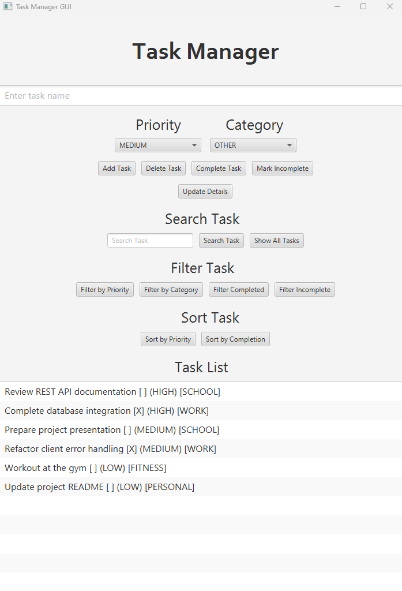

# Task Manager

A Java-based task management application built with a JavaFX desktop client and a Spring Boot REST API.

The project began as a simple console application and evolved through multiple versions into a client-server application with a graphical interface, RESTful backend, persistent database storage, validation, exception handling, and automated testing.

The project was developed as a long-term learning project focused on progressively applying software engineering concepts to a real application.



---

## Technical Highlights

- Built a JavaFX desktop application for managing tasks through a graphical user interface
- Developed a Spring Boot REST API to handle task creation, retrieval, updates, and deletion
- Implemented a layered backend architecture using Controller, Service, and Repository layers
- Used Spring Data JPA for database persistence
- Connected the JavaFX client to the backend using Java's `HttpClient`
- Implemented JSON serialization and deserialization for client-server communication
- Added input validation and centralized API exception handling
- Implemented searching, filtering, sorting, and task status management
- Used enums to provide type-safe priority and category values
- Wrote JUnit tests for core application behavior
- Managed the project with Maven, Git, and GitHub

---

## Technologies

- Java 21
- JavaFX
- Spring Boot
- Spring MVC
- Spring Data JPA
- H2 Database
- JDBC
- REST APIs
- HTTP
- JSON
- Jackson
- JUnit 5
- Maven
- Git
- GitHub
- IntelliJ IDEA
- Scene Builder

---

## Features

### Desktop Application

The JavaFX desktop client provides a graphical interface for managing tasks.

Users can:

- Add tasks
- Delete tasks
- Rename tasks
- Mark tasks as complete
- Mark tasks as incomplete
- Update task priority
- Update task category
- Search tasks by name
- Filter tasks by priority
- Filter tasks by category
- Filter completed tasks
- Filter incomplete tasks
- Sort tasks by priority
- Sort tasks by completion status
- Restore the full task list after searching or filtering

Each task contains:

- Name
- Completion status
- Priority
- Category

### Priority Levels

- HIGH
- MEDIUM
- LOW

### Categories

- WORK
- SCHOOL
- PERSONAL
- FITNESS
- FINANCE
- OTHER

---

## REST API

The Spring Boot backend exposes REST endpoints that allow clients to interact with task data through HTTP.

The API supports:

- Creating tasks
- Retrieving all tasks
- Retrieving individual tasks
- Updating tasks
- Deleting tasks
- Completing tasks
- Marking tasks incomplete
- Filtering tasks by priority
- Filtering tasks by category
- Filtering tasks by completion status

---

## Architecture

The project uses a client-server architecture.

```text
JavaFX Desktop Client
        |
        | HTTP / JSON
        v
Spring Boot REST API
        |
        v
TaskController
        |
        v
TaskService
        |
        v
TaskRepository
        |
        v
Spring Data JPA
        |
        v
H2 Database
```

### JavaFX Client

The JavaFX application handles user interaction and presentation.

`TaskController` manages the interface and responds to user actions.

`TaskManager` contains client-side operations such as searching, filtering, and sorting.

`TaskApiClient` communicates with the Spring Boot API using Java's `HttpClient`.

API responses are converted into desktop task objects before being displayed in the interface.

### Spring Boot Backend

The backend follows a layered architecture.

**TaskController**

Handles incoming HTTP requests and maps REST endpoints to application operations.

**TaskService**

Contains business logic and coordinates operations between the controller and repository.

**TaskRepository**

Extends Spring Data JPA's `JpaRepository` and handles database access.

**Task**

Represents the persistent task entity stored in the database.

**TaskRequest**

Acts as a request DTO for validating incoming task data.

**GlobalExceptionHandler**

Provides centralized handling for validation errors and other invalid requests.

---

## API Endpoints

### Retrieve Tasks

```http
GET /tasks
```

Returns all tasks.

```http
GET /tasks/{id}
```

Returns a specific task by ID.

---

### Create Task

```http
POST /tasks
```

Example request:

```json
{
  "name": "Review REST API documentation",
  "priority": "HIGH",
  "category": "SCHOOL"
}
```

---

### Update Task

```http
PUT /tasks/{id}
```

Example request:

```json
{
  "name": "Finish project documentation",
  "priority": "MEDIUM",
  "category": "SCHOOL"
}
```

---

### Delete Task

```http
DELETE /tasks/{id}
```

Deletes the task with the specified ID.

---

### Complete Task

```http
PUT /tasks/{id}/complete
```

Marks the selected task as completed.

---

### Mark Task Incomplete

```http
PUT /tasks/{id}/incomplete
```

Marks the selected task as incomplete.

---

### Filter by Priority

```http
GET /tasks/filter/priority?priority=HIGH
```

Returns tasks matching the specified priority.

---

### Filter by Category

```http
GET /tasks/filter/category?category=SCHOOL
```

Returns tasks matching the specified category.

---

### Filter by Completion Status

```http
GET /tasks/filter/completed?completed=true
```

Returns tasks matching the requested completion status.

---

## HTTP Status Codes

The API uses standard HTTP status codes to communicate request results.

| Status | Meaning |
|---|---|
| `200 OK` | Request completed successfully |
| `201 Created` | Task created successfully |
| `204 No Content` | Task deleted successfully |
| `400 Bad Request` | Invalid request data |
| `404 Not Found` | Requested task does not exist |

---

## Validation and Error Handling

The application includes validation on both the client and server sides.

The Spring Boot API validates incoming task requests before allowing them to reach the service layer.

Examples of invalid input include:

- Empty task names
- Invalid priority values
- Invalid category values
- Requests for tasks that do not exist

Validation failures are handled through a centralized exception handler.

The JavaFX client also catches API and connection errors so that backend failures do not crash the desktop application.

---

## Running the Project

### Requirements

Before running the project, install:

- Java 21 or newer
- Maven
- Git

An IDE such as IntelliJ IDEA is recommended.

---

### Clone the Repository

```bash
git clone <repository-url>
```

Navigate into the project:

```bash
cd TaskManager
```

---

### Run the Spring Boot API

The backend is located inside:

```text
taskmanager-api/
```

Navigate into the API project:

```bash
cd taskmanager-api
```

Run the Spring Boot application:

```bash
mvn spring-boot:run
```

The API runs locally on:

```text
http://localhost:8080
```

The backend must be running before the JavaFX client can communicate with it.

---

### Run the JavaFX Desktop Client

Make sure the Spring Boot API is running first.

From the root Task Manager project, run:

```bash
mvn javafx:run

```text
TaskManagerApp
```

The JavaFX application will launch and communicate with the Spring Boot API running on port `8080`.

---

## Testing

The project uses JUnit 5 for automated testing.

Tests have been written throughout the project's development to verify core application behavior, including:

- Task creation
- Task completion
- Task deletion
- Task editing
- Searching
- Filtering
- Sorting
- File persistence from earlier versions
- Core task management behavior

Tests can be run through IntelliJ IDEA or Maven.

```bash
mvn test
```

---

## Project Evolution

Task Manager was developed incrementally, with each version introducing a new software engineering concept or architectural improvement.

### V1 – Basic Task Manager

Created the original console application with basic task creation, viewing, completion, and deletion.

### V2 – Input Validation

Added stronger input validation and prevented invalid user input from crashing the application.

### V3 – File Persistence

Introduced file-based task saving and loading.

### V4 – Task Editing

Added the ability to edit existing tasks.

### V5 – Priority and Category

Expanded the task model with priorities and categories.

### V6 – Search, Filter, and Sort

Added tools for finding and organizing tasks.

### V7 – Refactoring

Improved navigation, reduced duplicated validation logic, and cleaned up class responsibilities.

### V8 – Documentation

Improved project documentation and GitHub presentation.

### V9 – Enums

Replaced String-based priority and category values with Java enums for stronger type safety.

### V10 – Exception Handling

Improved file handling, validation, and recovery from corrupted task data.

### V11 – Unit Testing

Expanded automated testing using JUnit 5.

### V12 – JavaFX

Converted the application from a console-only interface into a graphical desktop application.

### V13 – Database Persistence

Replaced file-based persistence with database storage and introduced database-backed task IDs.

### V14 – Spring Boot REST API

Introduced a Spring Boot backend and transformed the application into a client-server architecture.

The JavaFX application now communicates with the backend through HTTP and JSON instead of directly managing persistence.

### V15 – Finalization and Portfolio Polish

Focused on final code cleanup, JavaFX presentation improvements, documentation, repository organization, packaging, and preparing the project for portfolio use.

---

## What I Learned

Building Task Manager provided hands-on experience with:

- Object-Oriented Programming
- Java application architecture
- JavaFX desktop development
- REST API development
- Spring Boot
- Spring MVC
- Spring Data JPA
- Client-server architecture
- HTTP methods and status codes
- JSON serialization and deserialization
- Database persistence
- CRUD operations
- DTOs
- Input validation
- Exception handling
- Java enums
- Collections
- Searching, filtering, and sorting
- JUnit testing
- Maven dependency management
- Git and GitHub
- Incremental software development
- Refactoring and separation of responsibilities

One of the main goals of the project was to continually rebuild and improve the same application as new programming concepts were learned. This allowed each new technology to be applied to an existing codebase rather than being practiced only through isolated examples.

---

## Repository Structure

```text
TaskManager/
│
├── assets/
│   └── task-manager-desktop.png
│
├── src/
│   ├── main/
│   │   ├── java/
│   │   └── resources/
│   └── test/
│
├── taskmanager-api/
│   ├── src/
│   │   ├── main/
│   │   │   ├── java/
│   │   │   └── resources/
│   │   └── test/
│   └── pom.xml
│
├── docs/
├── pom.xml
├── README.md
└── .gitignore
```

---

## Releases

Task Manager V15 is available as a packaged Windows desktop application with a separate Spring Boot REST API.

### Release Files

The release includes:

- **Task Manager Windows Installer (`.exe`)** — Installs the JavaFX desktop application and its required Java runtime components.
- **Task Manager API (`.jar`)** — Runs the Spring Boot REST API and handles task persistence through the H2 database.

### Running the Release

#### 1. Start the API

Make sure Java 21 or newer is installed.

Open a terminal in the folder containing the API JAR and run:

```bash
java -jar taskmanager-api-0.0.1-SNAPSHOT.jar
```

Wait for the Spring Boot API to finish starting. The API runs locally on:

```text
http://localhost:8080
```

Keep the API running while using the desktop application.

#### 2. Install the Desktop Application

Run:

```text
Task Manager-15.0.0.exe
```

Complete the Windows installation process.

After installation, launch **Task Manager** from the desktop shortcut or Windows Start Menu.

The desktop application will connect to the Spring Boot API running on port `8080`.

### Data Storage

Task data is stored locally using an H2 file-based database.

The database is created automatically when the API runs and persists between application restarts.

Because the database is stored locally, task data is specific to the computer running the API and is not synchronized between devices.

### Important

The Spring Boot API must be running before using the desktop application. If the API is unavailable, the JavaFX client will not be able to retrieve or modify task data.

Only one instance of the API should access the same local H2 database at a time.

---

## Author

**Olamayowa Siji Layeni**

Computer Science  
Virginia Commonwealth University